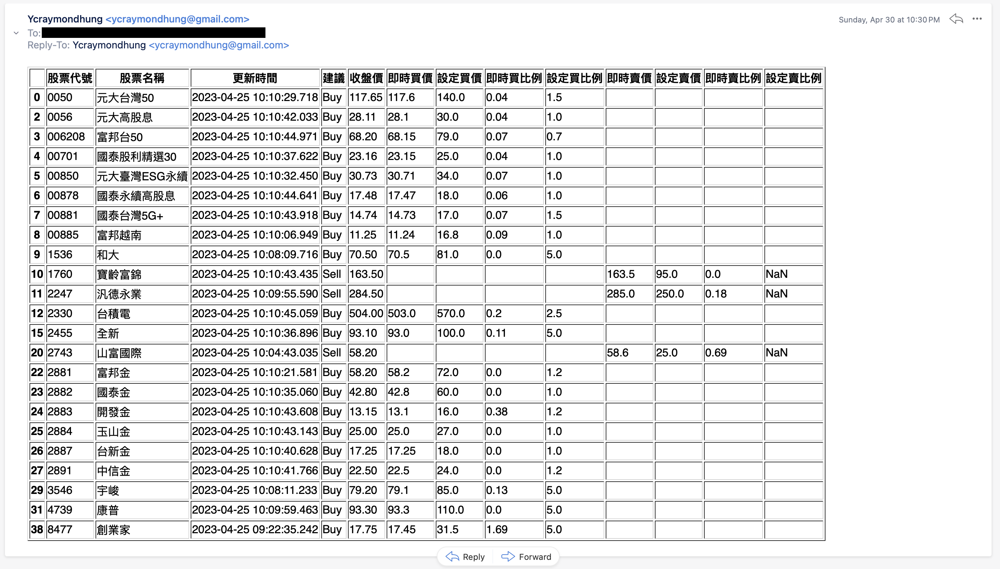

# Stock Price Tracker

### An application tracks stocks users are interested in and sends email notification as stock prices meet criteria

## Structure
- Deploy python scripts on PythonAnywhere to execute scripts every hour

## Features
- Collect users' target stock and their criteria on Google sheets with Google Sheet API
- Track stock price by connecting FinMind API
- Clean data and compare stock price info with users' criteria
- Notify users to take actions with emails

